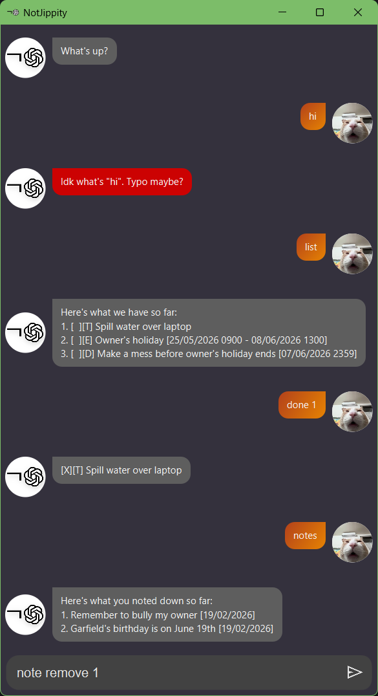

# NotJippity User Guide



NotJippity is a lightweight and powerful task manager app to help users stay organised and productive. With a unique messenger app-like interface, NotJippity allows users to easily create, manage, and track their tasks, events and deadlines. NotJippity is specially designed for fast typists, enabling them to quickly input and manage their tasks without the need for mouse interactions.

# Commands
```<>``` represents a required argument, while ```[]``` represents an optional argument. Commands are case-insensitive, but arguments must be in order.

## todo \<TaskName\>

Adds a todo task to the list of tasks with the given name.

Example: `todo Buy groceries for next week`

Expected Outcome:
```
A new todo task named "Buy groceries for next week" is added to the list of tasks, and a confirmation message is displayed to the user.
```
## deadline \<TaskName\> --by \<dd/MM/yyyy HHmm\>

Adds a deadline task to the list of tasks with the given name and due date.

Example: `deadline Submit assignment --by 30/06/2024 2359`

Expected Outcome:
```
A new deadline task named "Submit assignment" with a due date of June 30, 2024, at 11:59 PM is added to the list of tasks, and a confirmation message is displayed to the user.
```

## event \<TaskName\> --from \<dd/MM/yyyy HHmm\> --to \<dd/MM/yyyy HHmm\>

Adds an event task to the list of tasks with the given name and event date.

Example: `event Team meeting --from 01/07/2024 1300 --to 01/07/2024 1500`

Expected Outcome:
```
A new event task named "Team meeting" with a start date and time of July 1, 2024, at 1:00 PM and an end date and time of July 1, 2024, at 3:00 PM is added to the list of tasks, and a confirmation message is displayed to the user.
```

## list \[--date\] \[\dd/MM/yyyy]

Displays the list of all tasks, including their names, types, and statuses.

Example: `list`

Expected Outcome:
```
The user is presented with a list of all tasks, showing their names, types, and completion statuses.
```

Example: `list --date 30/06/2024`

Expected Outcome:
```
The user is presented with a list of all tasks that are due on June 30, 2024, showing their names, types, and completion status.
```

## done \<TaskIndex\>

Marks a task as completed based on its index in the list.

Example: `done 2`

Expected Outcome:
```
The task at index 2 in the list is marked as completed, and a confirmation message is displayed to the user.
```

## undo \<TaskIndex\>

Marks a task as incomplete based on its index in the list.

Example: `undo 2`

Expected Outcome:
```
The task at index 2 in the list is marked as incomplete, and a confirmation message is displayed to the user.
```

## toggle \<TaskIndex\>

Toggles the completion status of a task based on its index in the list.

Example: `toggle 2`

Expected Outcome:
```
The completion status of the task at index 2 in the list is toggled (if it was completed, it becomes incomplete, and vice versa), and a confirmation message is displayed to the user.
```

## delete \<TaskIndex\>

Deletes a task from the list based on its index.

Example: `delete 2`

Expected Outcome:
```
The task at index 2 in the list is deleted, and a confirmation message is displayed to the user.
```

## find \<Keyword(s)\>

Searches for tasks that contain the specified keyword in their names, case-insensitive.

Example: `find meeting`

Expected Outcome:
```
The user is presented with a list of tasks that contain the keyword "meeting" in their names, showing their names, types, and completion statuses.
```

## note \[add/delete] \[add: Description / delete: NoteIndex\]

Displays, adds, or deletes notes associated with a task based on its index in the list.

Example: `note`

Expected Outcome:
```
A list of all tasks with their associated notes is displayed to the user
```

Example: `note add Remember to bring the report`

Expected Outcome:
```
The note "Remember to bring the report" is added to the currently selected task, and a confirmation message is displayed to the user.
```

Example: `note delete 1`

Expected Outcome:
```
The note at index 1 associated with the currently selected task is deleted, and a confirmation message is displayed to the user.
```

## bye

Saves all changes and exits the NotJippity application.

Example: `bye`

Expected Outcome:
```
The NotJippity application is closed, and the user is returned to their desktop or command line interface.
```